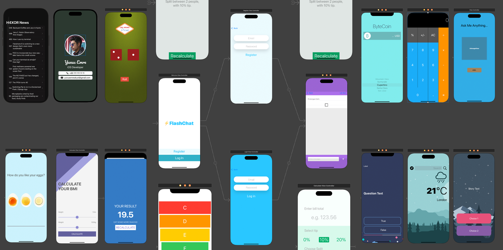

# Swift Education Kit 🚀

A curated collection of small Swift apps designed to help learners master iOS development — from UIKit basics to core design patterns and network integration.

## 📸 Screenshots

<p align="center">
  
</p>

## 📱 Projects Included

The repository contains **10+ Swift apps**, each showcasing a different topic:

- Dicee (Dice rolling UI)
- I Am Rich
- Xylophone (Soundboard)
- EggTimer
- Quizzler
- Destini
- BMI Calculator
- Tipsy
- Clima (Weather app, includes dark mode)
- ByteCoin (Crypto price fetcher)
- FlashChat (Chat app with Firebase Auth)
- Business Card app
- Dicee Observer & Detail View enhancements

## 🧠 Why This Kit?

This is a **hands-on learning toolkit** based on the [iOS 13 App Development Bootcamp](https://www.udemy.com/course/ios-13-app-development-bootcamp/) curriculum. It's ideal for those exploring iOS concepts through real-world mini-projects.

## 🛠️ Technologies & Topics Covered

- Swift & UIKit (storyboards, programmatic UI)
- Networking with `URLSession` & JSON decoding
- MVC, Delegate, Observer patterns
- Firebase Authentication
- Data persistence (e.g., CoreData / UserDefaults)
- UI layouts (Auto Layout, Dark Mode)
- Structuring modular, reusable code

## 🌐 Global Audience

The content is entirely in **English**, suitable for a global developer audience.

---

### 🔧 How to Run

1. Clone this repository:
   ```bash
   git clone https://github.com/ynsemre1/swift-education-kit.git
   ```
2. Open any app folder in Xcode (v11+).
3. Build and run on Simulator or device.

---

### 💡 Suggestions / Feedback

Contributions are welcome! Feel free to open issues or submit PRs with improvements, new mini‑apps, or bug fixes.
